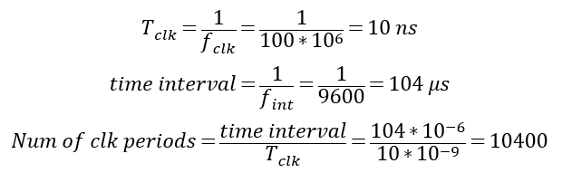
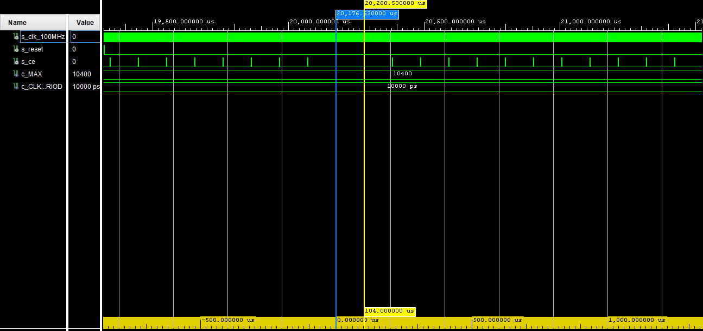
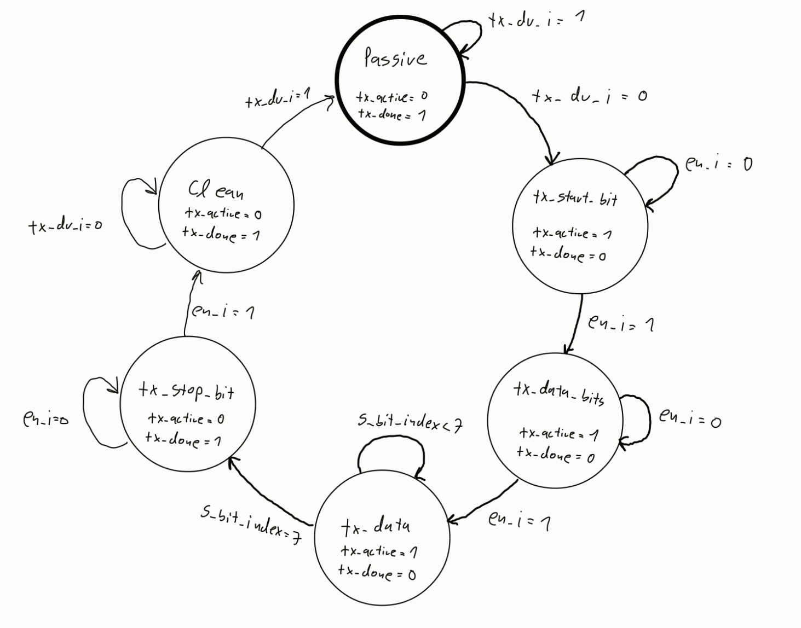
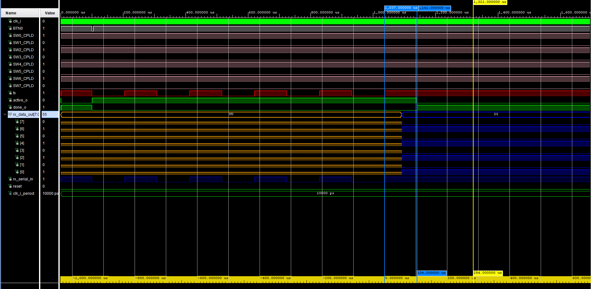

# UART interface in VHDL - BPC-DE1 team project

### Team members

* Syvak Mykyta (responsible for vhdl source code, resources)
* Jílek Jiří (responsible for GitHub, vhdl source code)

### Table of contents

* [Project objectives](#objectives)
* [Hardware description](#hardware)
* [VHDL modules description and simulations](#modules)
* [TOP module description and simulations](#top)
* [Video](#video)
* [References](#references)

<a name="objectives"></a>

## Project objectives

Our assignment: UART interface, ie UART transmitter and receiver. Let the UART frame structure is 8N1 and symbol rate is 9600 Bd.

1. Build and test needed components of UART
    * clock enable - send enable signal 9600 times every second -> 9600 baud rate
    * UART transmit - create 8N1 UART bit structure and send these bits to TX pin
    * UART recive - catch and show bits which are coming to RX pin
2. Implement VHDL code on Nexys A7 board
3. Learn how to work in team and use git

<a name="hardware"></a>

## Hardware description

* Used development board:
  * [Nexys A7](https://digilent.com/shop/nexys-a7-fpga-trainer-board-recommended-for-ece-curriculum/)
    * [Reference manual](https://digilent.com/reference/programmable-logic/nexys-a7/reference-manual?redirect=1)
    * [Schematics](https://digilent.com/reference/_media/programmable-logic/nexys-a7/nexys-a7-d3-sch.pdf)
    * Uses Artix-7-50T FPGA
    * 100 MHz internal clock

<a name="modules"></a>

## VHDL modules description and simulations

1. clock_enable.vhdl
    * [Clock_enable code](https://github.com/R4sp1/digital-electronics-1-project/blob/main/project-source-files/project_1/project_1.srcs/sources_1/new/clock_enable.vhd)
    * Used to generate clock signal at 9600 baud rate
    * We used folowing equation to determine number of internal 100 MHz clock pulses to generate one enable impulse which will corespond to 9600 bauds => 9600 Hz
    
        * 104 µs period equals to 9615.3846153846 Hz which is slightly more then 9600 Hz
    ```vhdl
    architecture Behavioral of clock_enable is
        signal s_cnt : std_logic_vector(16-1 downto 0) := x"0000";
        begin
        p_clk_enable : process(clk_i)
        begin
            if rising_edge(clk_i) then               -- Rising clock edge
                if srst_n_i = '0' then               -- Synchronous reset
                    s_cnt <= (others => '0');        -- Clear all bits
                    clock_enable_o <= '0';
                else
                    if s_cnt >= g_NPERIOD-1 then
                      s_cnt <= (others => '0');
                      clock_enable_o <= '1';
                    else
                     s_cnt <= s_cnt + x"0001";
                      clock_enable_o <= '0';
                    end if;
                end if;
            end if;
        end process p_clk_enable;
    end architecture Behavioral;
    ```
    
    * With every clock pulse on rising edge we add 1 to s_cnt which is set in top module to 10400, if we hit 10400-1 value we generate one enable signal

    
    * In simulation we can see internal clock pulses and when we hit 10400 pulses we generate one enable impulse

2. UART_transmit.vhdl
   * [UART transmit code](https://github.com/R4sp1/digital-electronics-1-project/blob/main/project-source-files/project_1/project_1.srcs/sources_1/new/UART_transmit.vhd)
   * Transmit 8 bits long message in 8N1 UART structure
   * 
        * State diagram of UART transmit module  
   * 8N1 UART structure corespond to 8 data bits, no parity and 1 stop bit. In normal state serial line is in it's high state (logic 1), if we want to send data we must introduce start bit => go to logical 0, then we send coresponding 8 data bits and in the end we send one stop bit => logical 1

   

   * In simulation (red signal) we can clearly see start bit (start bit is send after button is pressed which we can see in white signal) and then 8 bits acording to SW0 - SW7 switches (swithes are represented in pink colour), last bit corespond to stop bit but it's hard to recognise because tx line remains in HIGH state
   * In the bottom of the picture we can see that every bit have 104 µs period which corespond to 9600 baud rate

3. UART_receive.vhdl
    * [UART_receive code](https://github.com/R4sp1/digital-electronics-1-project/blob/main/project-source-files/project_1/project_1.srcs/sources_1/new/UART_recive.vhd)
    * In receive mode we must sample data line faster then baud rate to catch start bit, after start bit we sample invidual bits and adding them to counter which we send to output after stop bit

    

    * UART receive data line in simulation is showed in dark blue colour. We can see that LEDs (blue signals) are defined only after data are completely received. Number x55 in rx_data[] corespond to recived bit sequence "01010101" and that corespond to character "U" in ASCII table

4. testbench.vhdl
    * [Testbench code](https://github.com/R4sp1/digital-electronics-1-project/blob/main/project-source-files/project_1/project_1.srcs/sim_1/new/testbench.vhd)
    * Used to simulate and test components
    * Clock generation process:
    ```vhdl
    clk_i_process :process      -- start of generating clock impulses
    begin
		clk_i <= '0';
		wait for clk_i_period/2;
		clk_i <= '1';
		wait for clk_i_period/2;
    end process;
    ```
    * Send data process:

    ```vhdl
    stim_proc: process
    begin		
      -- hold reset state for 100 ns
      wait for 100 ns;	
      wait for clk_i_period*10000;
		
		BTN0 <= '0';                    -- start sending bits in 8N1 UART standart at 9600 baud
		wait for clk_i_period*400;
		
		BTN0 <= '1';					-- return to passsive state
		wait for clk_i_period*200;	
      wait;
    end process;
    ```


<a name="top"></a>

## TOP module description and simulations

[Top module code](https://github.com/R4sp1/digital-electronics-1-project/blob/main/project-source-files/project_1/project_1.srcs/sources_1/new/top.vhd)

After pin assignment we declared work entities and started sub codes as a clock_enble, UART_transmit and UART_receive. After that we assigned 10400 value as HEX code to s_bound signal which pass it to the clock counter.

For testing we used PuTTY software to which we send data selected by switches on the board and recived data from PuTTY which we showed on LEDs. For decoding we used ASCII table:


 Available online at Wikimedia: <a href="https://commons.wikimedia.org/wiki/File:ASCII-Table-wide.svg">ASCII-Table.svg: ZZT32derivative work: Usha</a>, Public domain, via Wikimedia Commons
 
<a name="video"></a>

## Video

Write your text here

<a name="references"></a>

## References

1. [tomas-fryza/digital-electronics-1 repository on GitHub](https://github.com/tomas-fryza/digital-electronics-1)
2. [UART basics](https://ece353.engr.wisc.edu/serial-interfaces/uart-basics/)
