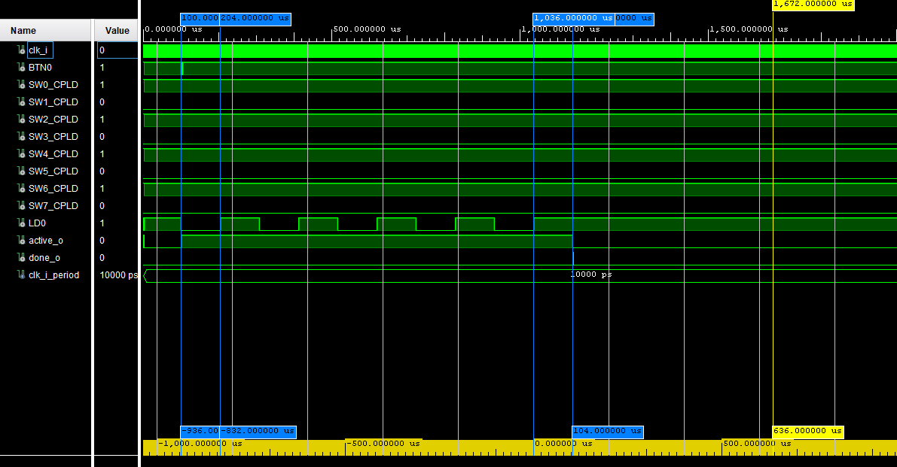

# UART interface, ie UART transmitter and receiver. Let the UART frame structure is 8N1 and symbol rate is 9600 Bd.

### Team members

* Syvak Mykyta (responsible for vhdl source code, resources)
* Jílek Jiří (responsible for GitHub, vhdl source code)

### Table of contents

* [Project objectives](#objectives)
* [Hardware description](#hardware)
* [VHDL modules description and simulations](#modules)
* [TOP module description and simulations](#top)
* [Video](#video)
* [References](#references)

## Project objectives

1. Build and test needed components of UART
    * clock enable - send enable signal 9600 times every second -> 9600 baud rate
    * UART transmit - create 8N1 UART bit structure and send these bits to TX pin
    * UART recive - catch and show bits which are coming to RX pin
2. Implement VHDL code on Nexys A7 board
3. Learn how to work in team and use git

## Hardware description

* Used development board:
  * [Nexys A7](https://digilent.com/shop/nexys-a7-fpga-trainer-board-recommended-for-ece-curriculum/)
    * [Reference manual](https://digilent.com/reference/programmable-logic/nexys-a7/reference-manual?redirect=1)
    * [Schematics](https://digilent.com/reference/_media/programmable-logic/nexys-a7/nexys-a7-d3-sch.pdf)

## VHDL modules description and simulations

1. clock_enable.vhdl
    * used to generate clock signal at 9600 baud rate
    * 104 µs period equals to 9615.3846153846 Hz which is slightly more then 9600 Hz
    * 

2. UART_transmit.vhdl
   * transmit 8 bits long message in 8N1 UART structure
   * 
   * in simulation we can clearly see start bit and then 8 bits acording to SW0 - SW7 switches, last bit corespond to stop bit
   * in the bottom of the picture we can see that every bit have 104 µs period which corespond to 9600 baud rate

3. testbench.vhdl
    * used to simulate and test components

## TOP module description and simulations

Write your text here.

## Video

Write your text here

## References

1. [tomas-fryza/digital-electronics-1 repository on GitHub](https://github.com/tomas-fryza/digital-electronics-1)
2. [UART basics](https://ece353.engr.wisc.edu/serial-interfaces/uart-basics/)
